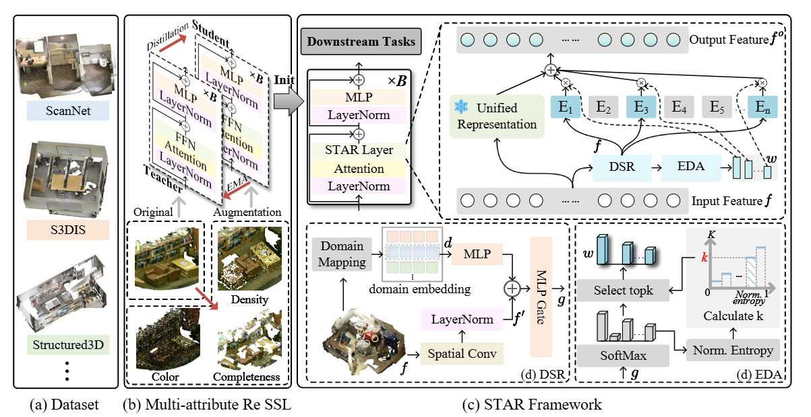

# STAR: A Spatial-Topology Aware Routing Framework for Generalizable 3D Scene Understanding


[](https://huggingface.co/koun123/STAR/tree/main)

This repository contains the official open-source implementation of **STAR**, built on top of Pointcept for generalizable 3D scene understanding.

If you find this project helpful, please consider giving us a star on GitHub ⭐️✨

## Framework




## Installation

Please follow the official Pointcept installation guide:  
[https://github.com/Pointcept/Pointcept?tab=readme-ov-file#installation](https://github.com/Pointcept/Pointcept?tab=readme-ov-file#installation)

## Data Preparation (ScanNet)

For ScanNet preprocessing, please refer to:  
[https://github.com/Pointcept/Pointcept?tab=readme-ov-file#scannet-v2](https://github.com/Pointcept/Pointcept?tab=readme-ov-file#scannet-v2)

Pointcept preprocessed ScanNet dataset can be downloaded [here](https://huggingface.co/datasets/Pointcept/scannet-compressed); please agree to the official license before downloading it.

## Inference

### ScanNet

1. Download the pretrained checkpoint from [Hugging Face (koun123/STAR)](https://huggingface.co/koun123/STAR/tree/main) and place it under:
   `exp/scannet/star_ft/model/`
2. Run inference:

```bash
bash infer.sh
```


## Acknowledgement

This project is built upon [Pointcept](https://github.com/Pointcept/Pointcept).  
We sincerely thank the authors and contributors of Pointcept for their excellent open-source work.

